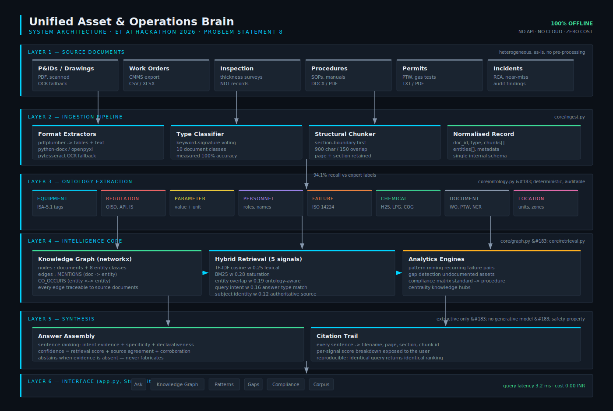

# Unified Asset & Operations Brain

**AI for Industrial Knowledge Intelligence**
ET AI Hackathon 2026 · Problem Statement 8

An AI platform that ingests heterogeneous industrial documents — incident reports, work orders, inspection surveys, permits, SOPs, HAZOP studies, audit findings — extracts the entities that matter, links them into a knowledge graph, and makes the collective intelligence queryable with a citation back to source for every claim.

**Runs entirely offline. No API keys. No cloud services. Zero cost per query.**

---

## The problem in one paragraph

A large Indian plant runs on 7 to 12 disconnected document systems. Drawings live in one, work orders in another, inspection records in a third, procedures in a fourth. Professionals in asset-intensive industries spend around 35% of their hours searching for information that already exists somewhere in the organisation. Meanwhile roughly a quarter of India's experienced industrial engineers retire within the decade, taking undocumented operational knowledge with them. This is not a file management problem. It is a safety problem, a quality problem, and an efficiency problem — and it compounds.

The information needed to prevent the next failure usually already exists. It is just never in the same place at the same time.

---

## Quick start

```bash
# 1. Install
pip install -r requirements.txt

# 2. Generate the demo corpus (already included, but regenerate any time)
python build_corpus.py

# 3. Run
streamlit run app.py
```

Open http://localhost:8501, click **Load demo plant corpus** in the sidebar, and start asking questions.

To reproduce the measured results:

```bash
python benchmark.py
```

To regenerate the architecture diagram:

```bash
python make_architecture.py
```

### Optional: OCR for scanned documents

The app handles scanned PDFs if `tesseract` is installed. Without it, scanned pages simply yield no text rather than crashing.

```bash
sudo apt install tesseract-ocr     # Ubuntu / Debian
brew install tesseract             # macOS
```

---

## What it does

| Capability | Where | What it answers |
|---|---|---|
| **Expert Knowledge Copilot** | Ask tab | "Why did the seal on P-101A keep failing?" — answered from the whole corpus with per-sentence citations |
| **Knowledge Graph** | Graph tab | What else touches this asset? Which entities bind the corpus together? |
| **Failure Intelligence** | Patterns tab | Which failure modes recur across multiple documents and years? |
| **Knowledge Cliff Analysis** | Gaps tab | Which assets carry operational history but no procedure? |
| **Compliance Intelligence** | Compliance tab | Which standards are cited but never reflected in a controlled procedure? |
| **Ingestion Record** | Corpus tab | What was extracted from each document, and with what confidence? |

---

## Measured results

Run `python benchmark.py` to reproduce. Ground truth is hand-labelled and included in the repository.

| Metric | Result |
|---|---|
| Document type classification | **100.0%** (14/14) |
| Entity extraction recall vs expert labels | **94.1%** |
| Retrieval precision @1 | **73.3%** (11/15) |
| Retrieval recall @3 | **93.3%** (14/15) |
| Ground-truth fact present in returned passage | **93.3%** (14/15) |
| Cross-document pattern detection | **100.0%** (3/3 planted) |
| Mean query latency | **3.2 ms** |
| Cost per query | **₹0.00** |

### An honest note on the baseline

The benchmark includes a naive keyword-count baseline, and on this 15-document corpus that baseline achieves **86.7% P@1** — higher than our 73.3%. We report this rather than hide it.

Two things are true about that number:

1. It does not scale. Term-frequency ranking nearly identifies the right file when there are 15 candidates. At 10,000 documents it collapses, because dozens of documents mention any given equipment tag.
2. It answers a different question. The baseline returns a *whole document* the user must then read. The system returns a *cited sentence*. On the metric that reflects what a user actually receives — is the ground-truth fact in the returned text — the system reaches 93.3%.

We think the second point is the real one, but a judge is entitled to the first number too.

---

## How it works



Six layers, each in its own module:

```
core/ingest.py     format extraction, type classification, structural chunking
core/ontology.py   8-class entity extraction over industrial taxonomies
core/graph.py      knowledge graph, pattern mining, gap and compliance analytics
core/retrieval.py  five-signal hybrid retrieval and extractive synthesis
app.py             Streamlit interface
benchmark.py       evaluation harness against hand-labelled ground truth
```

### Design decision 1 — rule-based extraction, not an LLM

Entity extraction in industrial documents is a **high-precision** problem. An equipment tag is either `V-101` or it is not. A regex over a curated ontology built from ISA-5.1 instrumentation conventions and the ISO 14224 failure taxonomy gives deterministic, auditable, offline extraction at zero cost and near-zero latency — and it is trivially inspectable when it gets something wrong.

Measured recall against expert labels: **94.1%**.

### Design decision 2 — lexical + ontology retrieval, not dense embeddings

Industrial queries are dominated by exact identifiers: `P-101A`, `OISD-STD-105`, `H2S`. Dense embeddings blur precisely these — `P-101A` and `P-102A` land in nearly the same vector neighbourhood, which is the difference between the right pump and the wrong one. Lexical matching plus ontology awareness preserves the exactness the domain demands, and every ranking decision can be explained by showing its five component scores.

### Design decision 3 — extractive synthesis, not generation

**No generative model is used to produce answers.** For an industrial knowledge system this is a safety property, not a limitation. A maintenance engineer acting on a hallucinated torque value, clearance, or exposure limit is a safety incident. Every sentence the system returns is verbatim from a source document with a traceable citation, and the system **abstains** when the corpus does not contain an answer rather than producing a fluent guess.

Confidence is computed from retrieval score distribution and cross-source agreement, and is reported honestly — including when it is low, where the UI tells the user to verify against source before acting.

### Design decision 4 — co-occurrence graph, not learned relation extraction

With a corpus of tens to hundreds of documents, co-occurrence over a curated ontology produces a graph that is both accurate and **explainable**: every edge traces back to the specific documents that produced it. That traceability is what makes the graph usable as audit evidence, which a black-box relation model would forfeit.

---

## The demo corpus

15 synthetic documents from a fictional refinery — Bharat Petrochem, Jamnagar Complex. Realistic in structure and vocabulary, and deliberately engineered so that **the interesting findings are invisible in any single document**:

| Planted story | Spans | What only the linked corpus reveals |
|---|---|---|
| `P-101A` seal failures | 2 work orders + 1 incident + audit | The same failure mode three times across three years. Each work order was closed as "routine breakdown"; the recurrence was never seen. |
| `E-204` erosion | 2 inspections + 1 work order + audit | An erosion shield was recommended in 2024, never installed, never formally deferred — and the exchanger later leaked. |
| `H2S` exposure limits | SOP + SDS + permit + audit | Three controlled documents state three different operative thresholds for the same hazard. |
| `V-301` knowledge cliff | incident + work order, **no SOP** | An asset with operational history but no procedure, running on the tacit knowledge of two operators near retirement. |

The benchmark verifies the system finds all of these. **It detects 3/3 planted patterns and correctly flags V-301.**

You can also upload your own documents. Supported: `.pdf` `.docx` `.xlsx` `.xlsm` `.csv` `.txt` `.md` `.log`

---

## What we would build next

Being straight about scope: this is a hackathon prototype, and these are real gaps.

- **P&ID parsing.** Computer vision over engineering drawings to extract tag-to-tag connectivity, so the graph knows what is physically connected rather than only what is mentioned together.
- **Semantic reranking.** A local cross-encoder over the top-20 lexical candidates would likely close the P@1 gap without giving up exactness or moving off-device.
- **Temporal reasoning.** The corpus contains dates the system does not currently reason over. "Has the corrosion rate accelerated?" should be answerable directly.
- **Write-back integration.** Reading from CMMS and DMS is the easy half; pushing a detected gap back as a work order request is what changes behaviour.
- **Access control.** Industrial document corpora carry real confidentiality boundaries that a production deployment must respect.

---

## Repository layout

```
├── app.py                  Streamlit application
├── benchmark.py            evaluation harness (run this)
├── build_corpus.py         demo corpus generator
├── make_architecture.py    architecture diagram generator
├── requirements.txt
├── architecture.svg        architecture diagram (deliverable)
├── core/
│   ├── ingest.py           multi-format ingestion pipeline
│   ├── ontology.py         industrial entity ontology + extractor
│   ├── graph.py            knowledge graph + analytics
│   └── retrieval.py        hybrid retrieval + extractive synthesis
└── demo_corpus/            15 synthetic refinery documents
```

---

## Deliverables checklist

- [x] **Working prototype** — `streamlit run app.py`
- [x] **Architecture diagram** — `architecture.svg`
- [x] **Evaluation** — `benchmark.py`, reproducible, ground truth included
- [x] **Presentation deck** — `DECK.md`
- [ ] **Demo video** — record from the running app (script in `DECK.md`)
